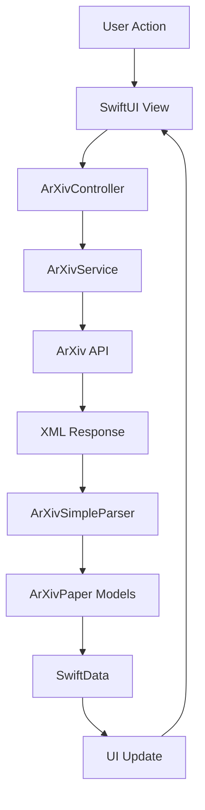

# Arquitectura Técnica - ArXiv App

## 🏗️ Visión General de la Arquitectura

ArXiv App implementa una arquitectura **Model-View-Controller (MVC)** moderna adaptada para SwiftUI, combinando los beneficios de la separación de responsabilidades tradicional con la reactividad de SwiftUI.

## 📐 Principios Arquitectónicos

### 1. Separación de Responsabilidades
- **Models**: Gestión de datos y lógica de dominio
- **Views**: Presentación y interacción del usuario
- **Controllers**: Coordinación y lógica de negocio
- **Services**: Comunicación externa y utilidades

### 2. Reactive Programming
- Uso de `@Published` para notificaciones automáticas
- `@ObservedObject` y `@StateObject` para binding reactivo
- Flujo de datos unidireccional

### 3. Dependency Injection
- Inyección de dependencias a través del entorno SwiftUI
- Contenedores de modelo compartidos
- Servicios como singletons cuando es apropiado

## 🔄 Flujo de Datos



## 📱 Adaptación Multiplataforma

### iOS Design
- **NavigationStack**: Navegación jerárquica
- **Sheet/Modal**: Presentación de detalles
- **Toolbar**: Acciones contextuales
- **Optimizado para touch**: Elementos táctiles apropiados

### macOS Design
- **NavigationSplitView**: Navegación en tres columnas
- **Sidebar**: Navegación principal
- **Window Management**: Ventanas redimensionables
- **Keyboard Shortcuts**: Accesos rápidos
- **Menu Bar**: Menús nativos

## 🗄️ Gestión de Datos

### SwiftData Implementation
```swift
@Model
final class ArXivPaper: @unchecked Sendable {
    // Propiedades del modelo
    var id: String
    var title: String
    var summary: String
    // ...
}
```

### Características:
- **Persistencia automática**: SwiftData maneja la persistencia
- **Queries reactivas**: `@Query` para actualizaciones automáticas
- **Relaciones**: Soporte para relaciones entre modelos
- **Migración**: Esquemas evolutivos

## 🌐 Arquitectura de Red

### ArXivService
```swift
final class ArXivService {
    // Singleton para gestión centralizada
    static let shared = ArXivService()
    
    // Configuración de sesión
    private let session = URLSession.shared
    
    // Métodos de API
    func searchPapers(query: String) async throws -> [ArXivPaper]
    func getLatestPapers() async throws -> [ArXivPaper]
}
```

### Características:
- **Async/Await**: Operaciones asíncronas modernas
- **Error Handling**: Manejo robusto de errores
- **Caching**: Caché inteligente de respuestas
- **Rate Limiting**: Respeto a límites de API

## 🎯 Estados de la Aplicación

### ArXivController States
```swift
@MainActor
final class ArXivController: ObservableObject {
    @Published var latestPapers: [ArXivPaper] = []
    @Published var csPapers: [ArXivPaper] = []
    @Published var mathPapers: [ArXivPaper] = []
    @Published var isLoading = false
    @Published var errorMessage: String?
    @Published var currentCategory: PaperCategory = .latest
}
```

### Gestión de Estados:
- **Loading States**: Indicadores de carga
- **Error States**: Manejo de errores
- **Empty States**: Estados vacíos
- **Success States**: Datos cargados exitosamente

## 🔧 Servicios Auxiliares

### ArXivSimpleParser
- **Propósito**: Parseo eficiente de XML de ArXiv
- **Características**:
  - Parsing incremental
  - Manejo de errores robusto
  - Validación de datos
  - Transformación de tipos

### Notification Service (macOS)
- **Propósito**: Notificaciones de escritorio
- **Características**:
  - Notificaciones locales
  - Acciones interactivas
  - Gestión de permisos

## 📊 Patrones de Diseño Utilizados

### 1. Observer Pattern
- `@Published` properties
- SwiftUI's reactive binding
- Automatic UI updates

### 2. Singleton Pattern
- `ArXivService.shared`
- Servicios globales compartidos

### 3. Factory Pattern
- Creación de modelos desde XML
- Configuración de vistas

### 4. Repository Pattern
- Abstracción de fuentes de datos
- Unificación de datos locales/remotos

## 🔒 Seguridad y Privacidad

### Datos Locales
- **SwiftData Encryption**: Datos cifrados localmente
- **Keychain Storage**: Credenciales seguras
- **Sandboxing**: Aislamiento de la app

### Comunicación de Red
- **HTTPS Only**: Comunicación segura
- **Certificate Pinning**: Validación de certificados
- **Data Validation**: Validación de respuestas

## 📈 Escalabilidad

### Horizontal Scaling
- **Modular Architecture**: Componentes independientes
- **Plugin System**: Extensibilidad futura
- **Feature Flags**: Activación condicional

### Vertical Scaling
- **Lazy Loading**: Carga bajo demanda
- **Pagination**: Carga incremental
- **Caching Strategy**: Optimización de memoria

## 🧪 Estrategias de Testing

### Unit Tests
- **Controllers**: Lógica de negocio
- **Services**: Comunicación de red
- **Models**: Validación de datos

### Integration Tests
- **API Integration**: Comunicación con ArXiv
- **Database Integration**: Persistencia SwiftData

### UI Tests
- **User Flows**: Navegación completa
- **Cross-Platform**: iOS y macOS

## 📋 Consideraciones Futuras

### Próximas Mejoras
1. **Offline-First**: Arquitectura offline-first
2. **Sync Service**: Sincronización multi-dispositivo
3. **GraphQL**: Migración a GraphQL
4. **Machine Learning**: Recomendaciones inteligentes
5. **Widget Support**: Widgets para iOS/macOS

### Refactoring Planeado
- **MVVM Migration**: Consideración de migración a MVVM
- **Combine Integration**: Integración con Combine
- **Core Data Migration**: Evaluación de Core Data vs SwiftData

---

*Esta documentación se actualiza continuamente para reflejar la evolución de la arquitectura.*
